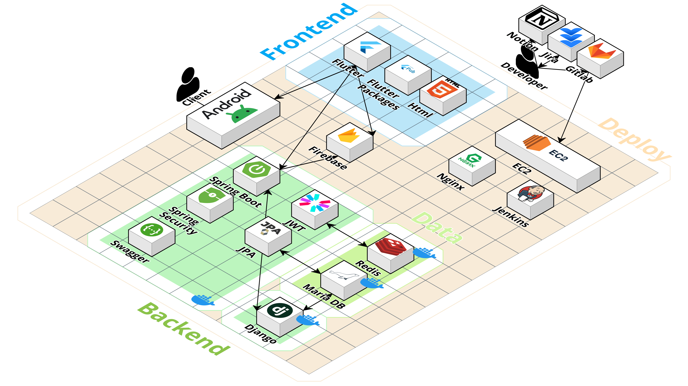
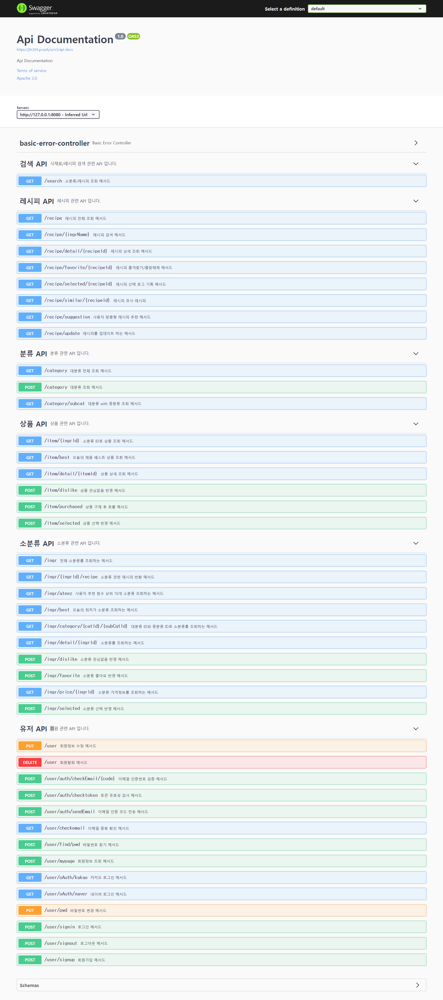
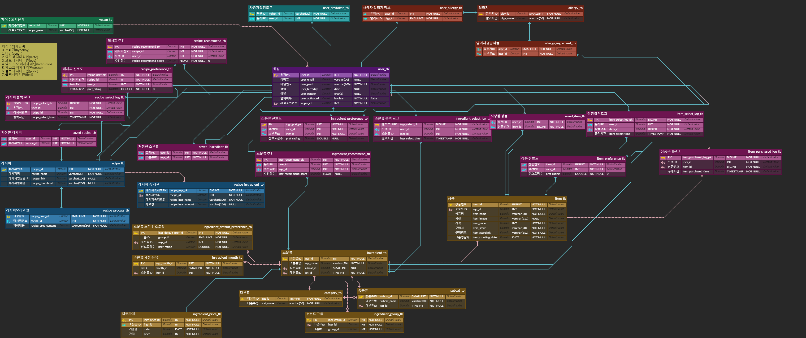

# 채움 
### 사용자 맞춤형 식재료 및 레시피 추천 앱 서비스
### Personal ingredient and recipe recommendation app service

<br>

## Team 👨‍👩‍👦‍👦
<table align="center">
    <tr align="center">
        <td><a href="https://github.com/skufmid">
            <br />
            <sub><b>전종헌</b></sub></a>
        </td>
        <td align="left">
            - Django <br> 
            - Database <br>
            - 추천 알고리즘 
        </td>
        <td ><a href="https://github.com/gunhoo">
            <br />
            <sub><b>박건후</b></sub></a>
        </td>
        <td align="left">
            - Spring <br>
            - Database <br>
            - Server & CI/CD
        </td>
        <td><a href="https://github.com/parkeg1223">
            <br />
            <sub><b>박은규</b></sub></a>
        </td>
        <td align="left">
            - Spring <br>
            - Database <br>
            - Django
        </td>
    </tr>
    <tr align="center">
        <td><a href="https://github.com/OH-Yeonju">
            <br />
            <sub><b>오연주</b></sub></a>
        </td>
        <td align="left">
            - Flutter <br>
            - UI/UX
        </td>
        </td>
            <td><a href="https://github.com/illu1996">
            <br />
            <sub><b>이지혁</b></sub></a>
        </td>
        <td align="left">
            - Flutter <br>
            - UI/UX
        </td>
        <td><a href="https://github.com/tsmich926">
            <br />
            <sub><b>황수아</b></sub></a>
        </td>
        <td align="left">
            - Flutter <br>
            - UI/UX
        </td>
    </tr>
</table>

<br>

## 개요 Introduction 📁
``` 
농축수산물 온라인 쇼핑 빈도수가 폭증하는 요즘, 여러분들은 ‘플랫폼이 너무 많아 어디서 사야할지 모르겠네' 또는, '나의 개인 맞춤형 농축수산물을 알아서 추천해주는 서비스는 없을까?' 라는 생각을 해보신 적 있나요?

채움은 그러한 니즈를 충족시켜주기 위해 탄생한 빅데이터 기반 사용자 맞춤형 추천 애플리케이션입니다. 채움와 함께라면, 농축수산물 구매를 손쉽게 할 수 있습니다.
```

<br>

## 개발 기간 Duration 📅

2023.08.28. - 2023.10.06. (6 weeks)

<br>

## 주요 기능 Main Function 🧰


### 메인페이지


- 최상단 검색 탭을 통해 식재료와 레시피를 검색할 수 있다.
- 식재료 분류를 확인하고 해당 식재료들을 확인할 수 있다.
- 오늘의 채움 베스트 상품들을 확인할 수 있다.
- 사용자 맞춤형 상품들을 확인할 수 있다.
- 오늘의 최저가 식재료를 확인할 수 있다.

### 레시피
#### 레시피 목록


- 하단 네비게이션 바를 통해 레시피들을 확인할 수 있다.
    - 아래로 스크롤하여 새로고침을 할 수 있다.
    - 위로 스크롤하여 여러 레시피들을 확인할 수 있다.
#### 레시피 상세 보기


- 레시피 조리 방법에 대해 확인할 수 있다.
- 유튜브 영상을 확인할 수 있다.
- 좋아요를 눌러 마이페이지에서 확인할 수 있다.
- 유사 레시피를 확인할 수 있다.

### 식재료
#### 식재료 카테고리

- 하단 네비게이션 바를 통해 식재료 카테고리를 확인할 수 있다.

#### 식재료 소분류


- 원하는 분류를 선택하면 해당 카테고리에 해당하는 식재료들을 보여준다.
- '알림설정'을 통해 가격이 크게 하락하면 앱 알림을 받을 수 있다.
- '관심없음'을 통해 해당 식재료를 추천하지 않도록 할 수 있다.

#### 식재료 상세조회


- 식재료 상세조회에서 상품, 가격정보, 레시피를 확인할 수 있다.
- 가격정보 탭에서는 최근 3개월 가격 변동 그래프를 확인하고 최저가 사이트에 접속할 수 있다.
- 레시피 탭에서는 해당 식재료가 포함된 레시피들을 확인할 수 있다.

### 검색


- 검색에 검색어를 입력하면 관련 식재료와 레시피 정보를 확인할 수 있다.

### 회원


- 이메일 인증을 통해 회원가입을 할 수 있다.
- 회원가입 시 성별, 연령, 알러지 여부, 채식 여부를 입력할 수 있다.


- 이메일을 통해 로그인을 할 수 있다.
- 네이버를 통해 로그인을 할 수 있다.
- 카카오를 통해 로그인을 할 수 있다.


- 내가 좋아요 한 레시피를 확인할 수 있다.
- 내가 좋아요 한 식재료를 확인할 수 있다. 
- 회원정보 수정을 통해 채식 및 알러지 여부를 변경할 수 있다.
- 비밀번호 변경 / 로그아웃 / 회원탈퇴를 할 수 있다.


<br>

## 주요 기술 Tech Stack 💡

### 시스템 아키텍쳐


### Tool 
```
- Project: Jira & Git & Notion
- Desgin: Figma
- Server: Amazon EC2
- APP: Flutter
- Recommend: Django
- CI/CD: Jenkins
```


### Version

```
BackEnd
 ├── Spring
 │    ├── Java: OpenJDK 11 
 │    ├── SpringBoot: 2.7.13
 │    │    ├── Gradle
 │    │    └── JPA
 │    ├── Spring Security
 │    │    └── JWT
 │    ├── Swagger 3.0
 │    ├── Naver Mail
 │    └── Social Login
 │         ├── Naver
 │         └── Kakao
 │
 ├── Django
 │    ├── Python: 3.11.4
 │    └── Django: 4.1.7 
 │
 └── Database
      ├── MariaDB 10.11.4
      └── Redis 3.0.504

FrontEnd
 ├── Dart 3.1.0
 └── Flutter 3.13.1
```

<br>

## 개발 가이드 Development Guild 

### [Convention](https://half-yamamomo-2ac.notion.site/Convention-f46b96c0a223459da1a034a20d4bd1f6?pvs=4)

### API


### ERD


### 가이드 🗞
[프로젝트 매뉴얼(포팅매뉴얼)](./exec/채움_포팅메뉴얼.pdf)  
[DumpSQL](./exec/dump.sql)  

<br>

## 폴더 구조 Directory structure 💡

### Spring structure
```
├─allergy
│  ├─controller
│  ├─entity
│  │  ├─composite
│  │  └─single
│  ├─id
│  ├─repository
│  └─service
├─category
│  ├─controller
│  ├─dto
│  ├─entity
│  ├─repository
│  ├─service
│  └─vo
├─chaeum
├─config
├─exception
├─ingredient
│  ├─controller
│  ├─converter
│  ├─dto
│  ├─entity
│  │  ├─composite
│  │  ├─id
│  │  └─single
│  ├─id
│  ├─repository
│  ├─service
│  └─vo
├─item
│  ├─controller
│  ├─converter
│  ├─dto
│  ├─entity
│  │  ├─composite
│  │  └─single
│  ├─id
│  ├─repository
│  ├─service
│  └─vo
├─jwt
│  └─service
├─mail
├─notification
│  ├─entity
│  │  └─composite
│  ├─id
│  ├─repository
│  └─service
├─recipe
│  ├─controller
│  ├─dto
│  ├─entity
│  │  ├─composite
│  │  └─single
│  ├─id
│  ├─repository
│  └─service
├─search
│  ├─controller
│  ├─dto
│  └─service
└─user
    ├─controller
    ├─converter
    ├─dto
    ├─entity
    ├─repository
    ├─service
    ├─util
    └─vo
```

### Flutter structure
```
│  firebase_options.dart
│  main.dart
│
├─api
│      firebaseapi.dart
│
├─category
│      categorymain.dart
│
├─detail
│      detail.dart
│      detailrecipe.dart
│      pricechart.dart
│      priceinfo.dart
│      pricetable.dart
│      productlist.dart
│      profile.dart
│      recomproduct.dart
│
├─ingredients
│      ingrfavbtn.dart
│      ingrmain.dart
│
├─main
│      mainbest.dart
│      mainbody.dart
│      maincarousel.dart
│      maincategory.dart
│      mainmybest.dart
│      mainrowprice.dart
│      splash.dart
│
├─recipe
│      player.dart
│      recipedetail.dart
│      recipemain.dart
│      recipemainlist.dart
│      similarrecipe.dart
│
├─repeat
│      bottom.dart
│      needlogin.dart
│      search.dart
│
├─search
│      searchingr.dart
│      searchlist.dart
│      searchmain.dart
│      searchmainrecipe.dart
│      searchrecipe.dart
│      searchresult.dart
│
├─store
│      searchstore.dart
│      userstore.dart
│
├─user
│      addinfo.dart
│      fav_food.dart
│      fav_rec.dart
│      findpassword.dart
│      login.dart
│      mypage.dart
│      my_more_food.dart
│      my_more_rec.dart
│      pageapi.dart
│      signup.dart
│      signuptimer.dart
│
└─webview
        webview.dart
```

